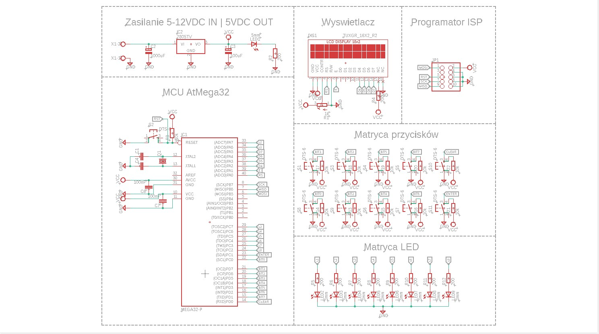
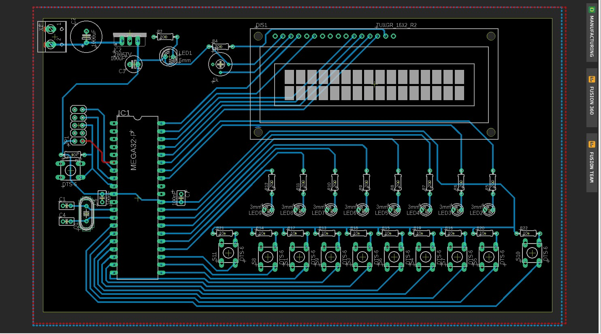

# Projekt Technika Mikroprocesorowa - Krystian Tutlewski
Kalkulator binarny 8-bitowy
# Opis działania
Posiadamy 10 przycisków (osiem oznaczających bity od 1 do 8, jeden przycisk enter oraz 1 przycisk clear).
Bit 1 ma wartość 1, bit 2 ma wartość 2, bit 3 ma wartość 4, bit 4 ma wartość 8 itd.
Dodatkowo posiadamy 8 diod LED, które zapalają się w zależności od naciśniętego przycisku i oznaczają daną wartość w systemie binarnym.
Przycisk Clear służy do zerowania całej konfiguracji, jednak jeżeli powtórnie naciśniemy ten sam przycisk to jego stan się wyzeruje.
Kalkulator jest 8-bitowy, dlatego maksymalna wartość, którą możemy wyświetlić wynosi 255 (2^8-1).
# Projekt schematyczny w programie Eagle

# Płytka w programie Eagle

# Wykorzystywane biblioteki:
Biblioteki zostały zaczerpnięte z tego źródła http://radzio.dxp.pl/hd44780/ oraz przerobione na potrzeby mojego projektu.
- HD44780.h 
```
HD44780.h

#include <avr/io.h>
#include <util/delay.h>

//-------------------------------------------------------------------------------------------------
//
// Konfiguracja sygnałów sterujących wyświetlaczem.
// Można zmienić stosownie do potrzeb.
//
//-------------------------------------------------------------------------------------------------
#define LCD_RS_DIR		DDRA
#define LCD_RS_PORT 	PORTA
#define LCD_RS			(1 << PA0)

#define LCD_E_DIR		DDRA
#define LCD_E_PORT		PORTA
#define LCD_E			(1 << PA1)

#define LCD_DB4_DIR		DDRA
#define LCD_DB4_PORT	PORTA
#define LCD_DB4			(1 << PA2)

#define LCD_DB5_DIR		DDRA
#define LCD_DB5_PORT	PORTA
#define LCD_DB5			(1 << PA3)

#define LCD_DB6_DIR		DDRA
#define LCD_DB6_PORT	PORTA
#define LCD_DB6			(1 << PA4)

#define LCD_DB7_DIR		DDRA
#define LCD_DB7_PORT	PORTA
#define LCD_DB7			(1 << PA5)

//-------------------------------------------------------------------------------------------------
//
// Instrukcje kontrolera Hitachi HD44780
//
//-------------------------------------------------------------------------------------------------

#define HD44780_CLEAR					0x01

#define HD44780_HOME					0x02

#define HD44780_ENTRY_MODE				0x04
	#define HD44780_EM_SHIFT_CURSOR		0
	#define HD44780_EM_SHIFT_DISPLAY	1
	#define HD44780_EM_DECREMENT		0
	#define HD44780_EM_INCREMENT		2

#define HD44780_DISPLAY_ONOFF			0x08
	#define HD44780_DISPLAY_OFF			0
	#define HD44780_DISPLAY_ON			4
	#define HD44780_CURSOR_OFF			0
	#define HD44780_CURSOR_ON			2
	#define HD44780_CURSOR_NOBLINK		0
	#define HD44780_CURSOR_BLINK		1

#define HD44780_DISPLAY_CURSOR_SHIFT	0x10
	#define HD44780_SHIFT_CURSOR		0
	#define HD44780_SHIFT_DISPLAY		8
	#define HD44780_SHIFT_LEFT			0
	#define HD44780_SHIFT_RIGHT			4

#define HD44780_FUNCTION_SET			0x20
	#define HD44780_FONT5x7				0
	#define HD44780_FONT5x10			4
	#define HD44780_ONE_LINE			0
	#define HD44780_TWO_LINE			8
	#define HD44780_4_BIT				0
	#define HD44780_8_BIT				16

#define HD44780_CGRAM_SET				0x40

#define HD44780_DDRAM_SET				0x80

//-------------------------------------------------------------------------------------------------
//
// Deklaracje funkcji
//
//-------------------------------------------------------------------------------------------------

void LCD_WriteCommand(unsigned char);
void LCD_WriteData(unsigned char);
void LCD_WriteText(char *);
void LCD_GoTo(unsigned char, unsigned char);
void LCD_Clear(void);
void LCD_Home(void);
void LCD_Initalize(void);

//-------------------------------------------------------------------------------------------------
//
// Koniec pliku HD44780.h
//
//-------------------------------------------------------------------------------------------------
```
- HD44780.c
```cpp

#include "HD44780.h"
//-------------------------------------------------------------------------------------------------
//
// Funkcja wystawiająca półbajt na magistralę danych
//
//-------------------------------------------------------------------------------------------------
void _LCD_OutNibble(unsigned char nibbleToWrite)
{
if(nibbleToWrite & 0x01)
	LCD_DB4_PORT |= LCD_DB4;
else
	LCD_DB4_PORT  &= ~LCD_DB4;

if(nibbleToWrite & 0x02)
	LCD_DB5_PORT |= LCD_DB5;
else
	LCD_DB5_PORT  &= ~LCD_DB5;

if(nibbleToWrite & 0x04)
	LCD_DB6_PORT |= LCD_DB6;
else
	LCD_DB6_PORT  &= ~LCD_DB6;

if(nibbleToWrite & 0x08)
	LCD_DB7_PORT |= LCD_DB7;
else
	LCD_DB7_PORT  &= ~LCD_DB7;
}
//-------------------------------------------------------------------------------------------------
//
// Funkcja zapisu bajtu do wyświetacza (bez rozróżnienia instrukcja/dane).
//
//-------------------------------------------------------------------------------------------------
void _LCD_Write(unsigned char dataToWrite)
{
LCD_E_PORT |= LCD_E;
_LCD_OutNibble(dataToWrite >> 4);
LCD_E_PORT &= ~LCD_E;
LCD_E_PORT |= LCD_E;
_LCD_OutNibble(dataToWrite);
LCD_E_PORT &= ~LCD_E;
_delay_us(50);
}
//-------------------------------------------------------------------------------------------------
//
// Funkcja zapisu rozkazu do wyświetlacza
//
//-------------------------------------------------------------------------------------------------
void LCD_WriteCommand(unsigned char commandToWrite)
{
LCD_RS_PORT &= ~LCD_RS;
_LCD_Write(commandToWrite);
}
//-------------------------------------------------------------------------------------------------
//
// Funkcja zapisu danych do pamięci wyświetlacza
//
//-------------------------------------------------------------------------------------------------
void LCD_WriteData(unsigned char dataToWrite)
{
LCD_RS_PORT |= LCD_RS;
_LCD_Write(dataToWrite);
}
//-------------------------------------------------------------------------------------------------
//
// Funkcja wyświetlenia napisu na wyswietlaczu.
//
//-------------------------------------------------------------------------------------------------
void LCD_WriteText(char * text)
{
while(*text)
  LCD_WriteData(*text++);
}
//-------------------------------------------------------------------------------------------------
//
// Funkcja ustawienia współrzędnych ekranowych
//
//-------------------------------------------------------------------------------------------------
void LCD_GoTo(unsigned char x, unsigned char y)
{
LCD_WriteCommand(HD44780_DDRAM_SET | (x + (0x40 * y)));
}
//-------------------------------------------------------------------------------------------------
//
// Funkcja czyszczenia ekranu wyświetlacza.
//
//-------------------------------------------------------------------------------------------------
void LCD_Clear(void)
{
LCD_WriteCommand(HD44780_CLEAR);
_delay_ms(2);
}
//-------------------------------------------------------------------------------------------------
//
// Funkcja przywrócenia początkowych współrzędnych wyświetlacza.
//
//-------------------------------------------------------------------------------------------------
void LCD_Home(void)
{
LCD_WriteCommand(HD44780_HOME);
_delay_ms(2);
}
//-------------------------------------------------------------------------------------------------
//
// Procedura inicjalizacji kontrolera HD44780.
//
//-------------------------------------------------------------------------------------------------
void LCD_Initalize(void)
{
unsigned char i;
LCD_DB4_DIR |= LCD_DB4; // Konfiguracja kierunku pracy wyprowadzeń
LCD_DB5_DIR |= LCD_DB5; //
LCD_DB6_DIR |= LCD_DB6; //
LCD_DB7_DIR |= LCD_DB7; //
LCD_E_DIR 	|= LCD_E;   //
LCD_RS_DIR 	|= LCD_RS;  //
_delay_ms(15); // oczekiwanie na ustalibizowanie się napiecia zasilajacego
LCD_RS_PORT &= ~LCD_RS; // wyzerowanie linii RS
LCD_E_PORT &= ~LCD_E;  // wyzerowanie linii E

for(i = 0; i < 3; i++) // trzykrotne powtórzenie bloku instrukcji
  {
  LCD_E_PORT |= LCD_E; //  E = 1
  _LCD_OutNibble(0x03); // tryb 8-bitowy
  LCD_E_PORT &= ~LCD_E; // E = 0
  _delay_ms(5); // czekaj 5ms
  }

LCD_E_PORT |= LCD_E; // E = 1
_LCD_OutNibble(0x02); // tryb 4-bitowy
LCD_E_PORT &= ~LCD_E; // E = 0

_delay_ms(1); // czekaj 1ms 
LCD_WriteCommand(HD44780_FUNCTION_SET | HD44780_FONT5x7 | HD44780_TWO_LINE | HD44780_4_BIT); // interfejs 4-bity, 2-linie, znak 5x7
LCD_WriteCommand(HD44780_DISPLAY_ONOFF | HD44780_DISPLAY_OFF); // wyłączenie wyswietlacza
LCD_WriteCommand(HD44780_CLEAR); // czyszczenie zawartosći pamieci DDRAM
_delay_ms(2);
LCD_WriteCommand(HD44780_ENTRY_MODE | HD44780_EM_SHIFT_CURSOR | HD44780_EM_INCREMENT);// inkrementaja adresu i przesuwanie kursora
LCD_WriteCommand(HD44780_DISPLAY_ONOFF | HD44780_DISPLAY_ON | HD44780_CURSOR_OFF | HD44780_CURSOR_NOBLINK); // włącz LCD, bez kursora i mrugania
}

//-------------------------------------------------------------------------------------------------
//
// Koniec pliku HD44780.c
//
//-------------------------------------------------------------------------------------------------
```
# Kod programu:
```cpp
#include <avr/io.h>
#include <util/delay.h>
#include <stdlib.h>
#include <avr/HD44780.h>
#include "avr/HD44780.c"

//definicje nazw dla LEDow
#define Led1 (1<<PA6)
#define Led2 (1<<PA7)
#define Led3 (1<<PC7)
#define Led4 (1<<PC6)
#define Led5 (1<<PC5)
#define Led6 (1<<PC4)
#define Led7 (1<<PC3)
#define Led8 (1<<PC2)
//definicje nazw dla Przyciskow
#define Enter (1<<PC1)
#define bit0 (1<<PC0)
#define bit1 (1<<PD7)
#define bit2 (1<<PD6)
#define bit3 (1<<PD5)
#define bit4 (1<<PD4)
#define bit5 (1<<PD3)
#define bit6 (1<<PD2)
#define bit7 (1<<PD1)
#define Clear (1<<PD0)

int main(void){

	//inicjowanie Wyjsc
	DDRA |= Led1;
	DDRA |= Led2;
	DDRC |= Led3;
	DDRC |= Led4;
	DDRC |= Led5;
	DDRC |= Led6;
	DDRC |= Led7;
	DDRC |= Led8;
	//inicjowanie Wejsc
	PORTC |= Enter;
	PORTC |= bit0;
	PORTD |= bit1;
	PORTD |= bit2;
	PORTD |= bit3;
	PORTD |= bit4;
	PORTD |= bit5;
	PORTD |= bit6;
	PORTD |= bit7;
	PORTD |= Clear;

	LCD_Clear();
	LCD_GoTo(0,0);
	LCD_WriteText("8bit kalkulator");
	LCD_GoTo(0,1);

	int liczba=0; //liczba koncowa
	int jeden=0, dwa=1, trzy=0, cztery=0, piec=0, szesc=0, siedem=0, osiem=0;
	char liczbaCHAR[3];
	while(1){

		if(!(PINC & bit0)){
			if(jeden==0){
				jeden=1;
				PORTA |= Led1;
			}
			else{
				jeden=0;
				if(PINA & Led1){
					PORTA ^= Led1;
				}
			}
		}
		if(!(PIND & bit1)){
			if(dwa==0){
				dwa=1;
				PORTA |= dwa;
			}
			else{
				dwa=0;
				if(PINA & Led2){
					PORTA ^= Led2;
				}
			}
		}
		if(!(PIND & bit2)){
			if(trzy==0){
				trzy=1;
				PORTC |= Led3;
			}
			else{
				trzy=0;
				if(PINC & Led3){
					PORTC ^= Led3;
				}
			}
		}
		if(!(PIND & bit3)){
			if(cztery==0){
				cztery=1;
				PORTC |= Led4;
			}
			else{
				cztery=0;
				if(PINC & Led4){
					PORTC ^= Led4;
				}
			}
		}
		if(!(PIND & bit4)){
			if(piec==0){
				piec=1;
				PORTC |= Led5;
			}
			else{
				piec=0;
				if(PINC & Led5){
					PORTC ^= Led5;
				}
			}
		}
		if(!(PIND & bit5)){
			if(szesc==0){
				szesc=1;
				PORTC |= Led6;
			}
			else{
				szesc=0;
				if(PINC & Led6){
					PORTC ^= Led6;
				}
			}
		}
		if(!(PIND & bit6)){
			if(siedem==0){
				siedem=1;
				PORTC |= Led7;
			}
			else{
				siedem=0;
				if(PINC & Led7){
					PORTC ^= Led7;
				}
			}
		}
		if(!(PIND & bit7)){
			if(osiem==0){
				osiem=1;
				PORTC |= Led8;
			}
			else{
				osiem=0;
				if(PINC & Led8){
					PORTC ^= Led8;
				}
			}
		}
		if(!(PINC & Enter)){
			LCD_GoTo(6,1);
			itoa(liczba, liczbaCHAR, 10);
			LCD_WriteText(liczbaCHAR);
		}
		if(!(PIND & Clear)){
			LCD_Clear();
			LCD_GoTo(0,0);
			LCD_WriteText("8bit kalkulator");
			LCD_GoTo(0,1);
			jeden=0;
			dwa=0;
			trzy=0;
			cztery=0;
			piec=0;
			szesc=0;
			siedem=0;
			osiem=0;
			liczba=0;
			if(PINA & Led1){
				PORTA ^= Led1;
			}
			if(PINA & Led2){
				PORTA ^= Led2;
			}
			if(PINC & Led3){
				PORTC ^= Led3;
			}
			if(PINC & Led4){
				PORTC ^= Led4;
			}
			if(PINC & Led5){
				PORTC ^= Led5;
			}
			if(PINC & Led6){
				PORTC ^= Led6;
			}
			if(PINC & Led7){
				PORTC ^= Led7;
			}
			if(PINC & Led8){
				PORTC ^= Led8;
			}
			itoa(liczba, liczbaCHAR, 10);
		}

		liczba=(jeden*1)+(dwa*1)+(trzy*1)+(cztery*1)+(piec*1)+(szesc*1)+(siedem*1)+(osiem*1);
		_delay_ms(300);


	}
}
```
